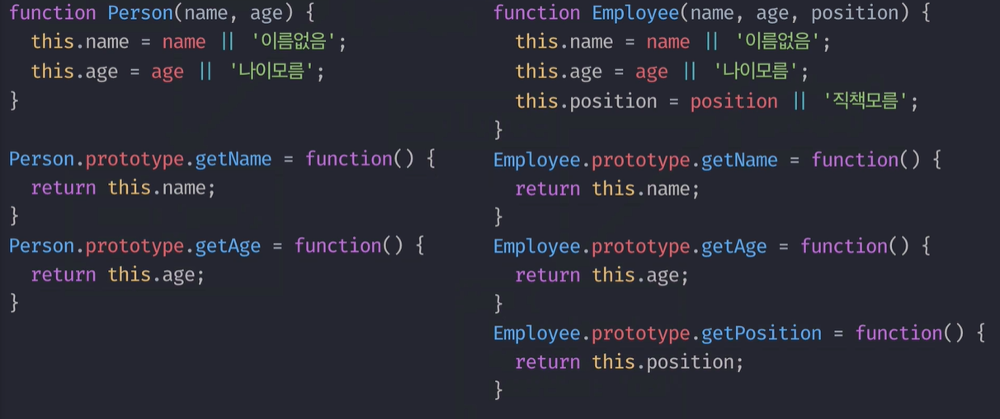

# Class 상속


* **Person**이라는 class는 `name, age` 프로퍼티가 있고, 

  `getName() / getAge()` 라는 메소드를 사용할 수 있습니다. 

* **Employee**라는 class는 `name, age, position` 프로퍼티가 있고, `getName() / getAge() / getPosition()`이라는 메소드를 사용할 수 있습니다.


코드로 표현하면 다음과 같이 표현할 수 있습니다. 



**Person 생성자** 함수와 **Employee 생성자** 함수 그리고 각 **프로토타입 메소드**들로 이루어져 있습니다.

그런데 `getName() / getAge()`라는 겹치는 메소드가 보입니다. 

그림으로 다시 본다면 다음과 같이 이해할수 있는데, 


그럼 지난시간에 살펴본 과일과 음식의 관계처럼

Person을 상위 클래스로, Employee를 하위 클래스로 만들어 주면 될것 같습니다. 


겹치는 메소드는 상위클래스에만 남겨두고 

그렇게 Employee의 instance는 PrototypeChanning을 타고 Employee의 메소드와 상위 클래스Person의 메소드를 모두 사용할 수 있게 되겠죠 ??

그럼 이런 다중 상속구조를 어떻게 구현해야 할까요? 그림으로 먼저 살표보겠습니다. 


이걸 코드로 표현하면 `Employee.prototype = new Person()` 이렇게 표현할 수 있죠. 

즉 Employee prototype에 Person의 Instance를 할당하면 되는 것입니다. 

다만 이게 전부는 아니고 추가로 한단계를 거쳐주기만 하면 되는데, 

위 코드의 결과는 Employee의 prototype을 단순히 Person의 instance로 대체해 버리기 때문에 기존 가져야할 prototype과 같이 동작하게 해주기 위해서는 본래 기능을 다시 구현해 주어야 합니다. 

`Employee.prototype.constructor = Employee` 이렇게 하면 서로 다른 두개의 클래스가 super와 sub클래스 관계를 가지게 됩니다.


* Employee.prototype과 Person의 instance를 연결하고,
* Employee.prototype의 constructor에 Employee를 부여해서 원래 prototype의 같은 기능을 수행하도록 했으며,
* 이전에 메소드를 생성하면 어차피 Person의 instance로 대체되기 때문에 getPosition을 후에 등록해주었습니다. 

이를 출력해보면 다음과 같이 나타납니다. 


이렇게 상속관계가 잘 연결이 되었습니다 단, 밑줄이 그어진 부분에서 문제가 나타납니다. 

> 추상적이여야 할 클래스의 prototype에 담겨있는 것이 문제가 될 수 있습니다.

만약 **Employee의 name**`'고무'`가 없다고 생각해 보세요. 원래라면 `undifined`가 반환되어야 하지만 **prototype channing**을 타고 `"이름없음"`이 반환될 것입니다. 

뭔가 prototype안에 프로퍼티가 아닌 메소드만 존재하게끔 바꿔주고 싶게 되지 않았나요?


불필요한 프로퍼티를 어떻게 지워야 할까요? 


1. 비어있는 객체를 생성하는 Bridge생성자 함수를 만들어 주었습니다.\(둘사이의 다리역할\)
2. Bridge의 prototype에 Person의 prototype을 연결해 Employee를 생성하면 그 instance에는 아무 프로퍼티 없이 메소드만 상속받는 형태가 됩니다.
3. 그상태에서 Employee의 prototype과 Bridge의 instance를 연결하면 될것 같습니다. 


위 그림과 같은 내용인데 코드를 통해 알아보아요. 


1. **Bridge**는 아무런 프로퍼티를 생성하지 않는 **빈 생성자 함수**입니다. 
2. **Bridge의 prototype**에 **Person의 prototype**을 덮어 씌워 메소드만 넘겨 받습니다. 
3. **Employee의 prototype**에 **Bridge의 instance**와 **연결**해 줍니다. \(Bridge는 Person의 에서 받은 메서드만 가지고 있습니다\)
4. Employee의 prototype에 **constructor가 다시 Employee**를 가리키게끔 복원시켜 줍니다. 
5. 그리고 Employee의 prototype에 **getPosition메소드를 추가**해주었습니다. 

결과를 확인해 봅시다.

```javascript
var gomu = new Employee('고무',30,'CEO');
console.dir(gomu);
```


Bridge라는 매개체를 이용해 Person의 불필요한 instance와 연결고리를 끊고 필요한 prototype메소드만 가져옴으로 인해 prototype chain상에 불필요한 프로퍼티가 등장하지 않게끔 했습니다.


또한 Bridge는 실제 코드상에 영향을 전혀 주지 않기 때문에 "더글라스 크락포드"는 아래와 같이 함수화 시켜서 사용하는 것을 추천하고 있습니다. 


이로 얻을 수 있는 이점은

 closure를 이용해 Bridge생성자 함수를 단 한번만 생성해 계속 재활용할수 있고, 

super와 sub클래스로 쓰일 생성자 함수를 매개변수로 넘겨주면 자동으로 둘 사이에 상속구조를 연결 해 주는 함수입니다. 

이를 활용해 아래와 같이 더 간단하게 상속을 구현할 수 있습니다.


만들어진 extendClass함수를 활용해 계속 상속관계를 만들어 줄 수 있는 것이죠. 


메소드 상속 뿐만 아니라 value들 역시 상속구조를 활용하면 좀더 간단한 구현이 가능합니다. 

다음으로 아래 코드를 보면 똑같은 코드가 반복되고 있습니다. 


그런데 그냥 아래와 같은 방법으로 프로퍼티를 구현할 수 있다면 더 편리하겠죠.


방법은 매우 간단합니다. 


1. 생성자 함수의 this는 instance를 가리킵니다. \(여기서는 Employee의 instance\)
2. Employee의 instance에는 superClass라는 메소드가 없으니 prototypeChanning을 타고 prototype내부에서 superClass를 검색하고 있으니 해당 메소드를 실행합니다. 
3. superClass메소드에는 Parent 즉 Person이 연결되어있으니 Person 생성자 함수가 메소드로서 호출됩니다. 
4. 메소드내부에서 this는 .앞부분을 가리키기 때문에 superClass의 this는 원래의 this즉, Employee의 instance가 this가 됩니다. 
5. 따라서 this.superClass\(\) 메소드를 호출하면 Employee instance의 name , age 각각 프로퍼티에 값을 할당하라는 명령이 되는 것입니다. 


### 최종


1. 클래스 상속을 구현하기 위해 extendClass라는 함수를 위에 정의했고, 
2. 실제 super클래스와 sub클래스의 구체적인 내용은 아래에서 구현하고 있습니다. 

매우 복잡한 과정을 거쳐왔지만 개념자체가 아주 어려운 것은 아니라는 것을 알 수 있습니다.


사실 es6가 나온지 시간이 매우 지난 지금은 extendClass함수를 직접 구현하지 않아도, 내장된 명령어로 쉽게 class상속을 구현할 수 있습니다. 아래와 같이 말이죠.


직접 만들어 구현해본 이유는 소스안에 지금까지 다루었던 내용들을 모두 담고 있었기 때문입니다..

감동..

